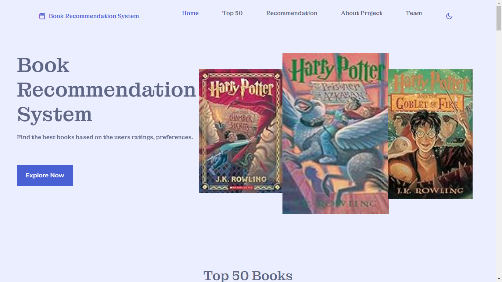
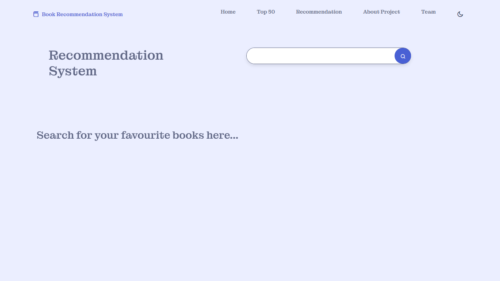
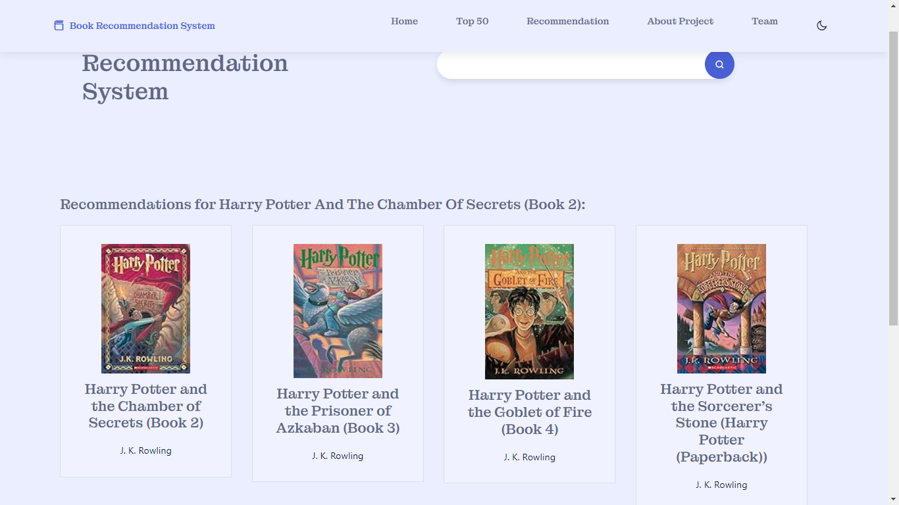
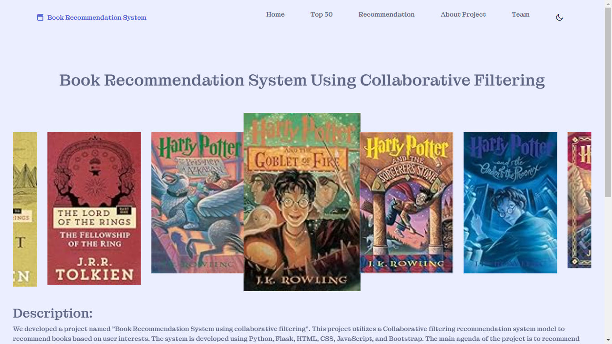
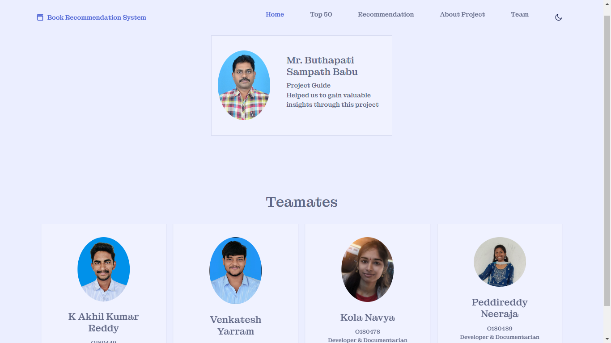

# Book Recommendation System

## Overview
The Book Recommendation System is a web application that suggests books to users based on their interests and ratings. The system utilizes a collaborative filtering model for personalized recommendations and a popularity-based system to display the top 50 books. The application is developed using Python, with a web interface created using HTML, CSS, and JavaScript.

## Features
- **Personalized Book Recommendations**: Based on user ratings and interests.
- **Top 50 Books**: Displays the most popular books from the dataset.
- **User-Friendly Interface**: Simple and intuitive design for easy navigation.

## Screenshots
### Home Page


### Top 50 Picks


### Recommendations


### Searched Results


### About Project


### Developers



## Technologies Used
- **Backend**: Python 3.10
- **Web Framework**: Flask
- **Data Manipulation**: Pandas, Numpy
- **Model Persistence**: Pickle
- **Frontend**: HTML, CSS, JavaScript
- **Dataset**: Kaggle

## Installation Guide

### Prerequisites
- Python 3.10
- Visual Studio Code (VS Code)
- Git (optional, for cloning the repository)

### Setting Up the Project

1. **Clone the Repository**
   ```bash
   git clone https://github.com/yourusername/book-recommendation-system.git
   cd book-recommendation-system
   ```
2. **Create a Virtual Environment**
    - Open VS Code and navigate to the project directory. Then, follow these steps to create and activate a virtual environment:
    -  Open the terminal in VS Code (Ctrl + ).
    -  Create the virtual environment:
       ```bash
        python -m venv venv
       ```
    - Activate the virtual environment:
    - Windows:
     ```bash
      .\venv\Scripts\activate
      ```
    - macOS/Linux:
      ```bash
      source venv/bin/activate
      ```
3. **Install Required Modules**
  - With the virtual environment activated, install the necessary modules:
    ```bash
     pip install -r requirements.txt
     ```
4. **Running the Application**
- Ensure the virtual environment is activated.
- Run the Flask application:
  ```bash
  python app.py
  ```
- Open your web browser and go to http://127.0.0.1:5000 to see the application in action.
## Usage
- Home Page: Explore various sections of the application.
- Top 50 Picks: View the most popular books.
- Recommendations: Get personalized book recommendations based on your ratings and preferences.
## Dataset
The dataset used in this project is sourced from Kaggle. It includes user ratings and other relevant information required to build the recommendation model.

## Contributing
Contributions are welcome! Please feel free to submit a Pull Request.

## License
This project is licensed under the MIT License.

## Contact
For any queries or suggestions, please reach out to venkatesh.aideveloper192@gmail.com.


